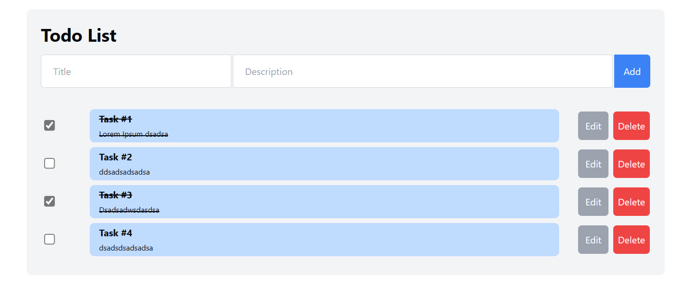

# Coding Exercise - Todo List App

## Frameworks
1. Vue.js
2. Tailwind.css
3. shadcn-vue
4. Typescript

## How to install

1. Clone this repositoy:

```bash
git clone https://github.com/OuraniosZefs/coding_exercise_todo_app.git
```
2. Install dependencies
```bash
npm install
```
3. Run project

```bash
npm run dev
```

## Screenshots
1. Display UI


2. Editing Tasks


3. Error Validation

